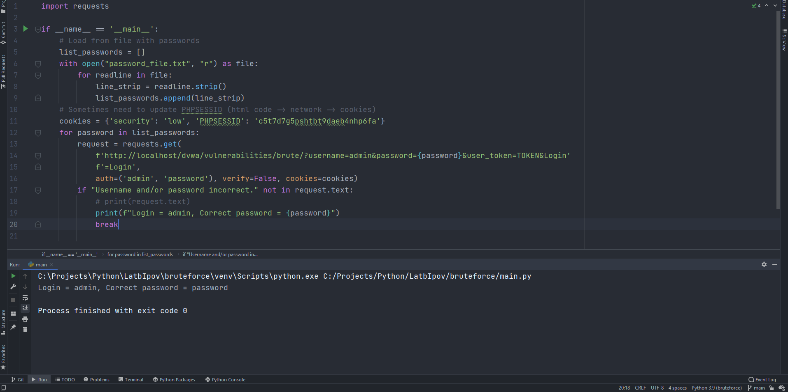

# BruteForce

## 1 Пункт

Необходимо разработать переборщик паролей для формы в задании Bruteforce на сайте dvwa.local (Можно использовать официальный ресурс или виртуальную машину Web Security Dojo)

Программа написана в файле main.py.
Результат работы программы:


## 2 Пункт
Проанализировать код и сделать кодревью, указав слабые места. Слабость уязвимого кода необходимо указать с использованием метрики CWE (база данных cwe.mitre.org)

1. CWE-20: Неправильная проверка кода (https://cwe.mitre.org/data/definitions/20.html)
   
   ```php
   $_GET[ 'username' ];
   $pass = $_GET[ 'password' ]; 
   ```

2. CWE-89: Неправильная нейтрализация специальных элементов, используемых в команде SQL («SQL-инъекция») (https://cwe.mitre.org/data/definitions/89.html)
   
   ```php
   $query  = "SELECT * FROM `users` WHERE user = '$user' AND password = '$pass';";
   ```

3. CWE-79: Неправильная нейтрализация ввода во время создания веб-страницы («Межсайтовый скриптинг») (https://cwe.mitre.org/data/definitions/79.html)

   ```php
   $html .= "<p>Welcome to the password protected area {$user}</p>";
   $html .= "";
   ```
4. CWE-328: CWE-328: Использование слабого хеширования (https://cwe.mitre.org/data/definitions/328.html)

   ```php
   $pass = md5( $pass );
   ```

## 3 Пункт

Разработать свою систему авторизации на любом языке, исключающий возможность подбора паролей разработанным переборщиком паролей в задании 1. Возможно исправление авторизации из dvwa.local.

В моём случае я исправлю участок кода из dvwa.local

Для устранения ввода SQL запросов я использовал регулярное выражение и функцию,
>  preg_grep(string $pattern, array $array): array|false

 которая возвращает массив из подходящих под шаблон выражений. В данном случае оно будет одно.

Для усложнения BruteForce можно реализовать вариант, при котором за неудачную попытку ввести пароль необходимо подождать n количество времени. Начиная от 5-10 минут результат будет эффективным. Для этого использую функцию 
> sleep(rand(100, 600))

где число - количество секунд ожидания

Также была добавлена блокировка при повторной попытке ввести неправильный пароль. Это также способствует устранению проблемы с BruteForce.

После изменений файла, он был проверен статическим анализатором и уязвимостей не нашёл. 


