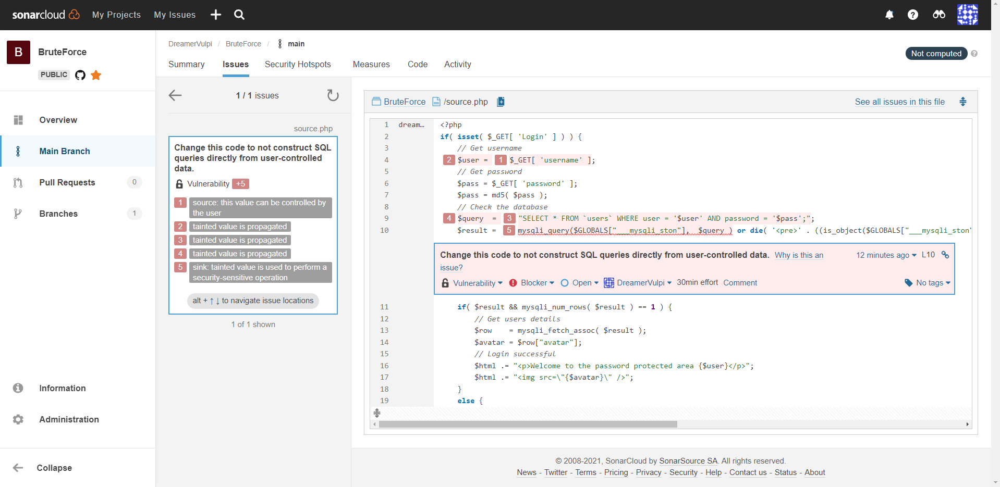
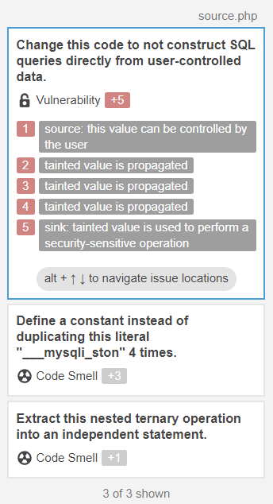

# BruteForce

## 1 Пункт

Необходимо разработать переборщик паролей для формы в задании Bruteforce на сайте dvwa.local (Можно использовать официальный ресурс или виртуальную машину Web Security Dojo)

Программа написана в файле main.py.
Результат работы программы:

## 2 Пункт
Проанализировать код и сделать кодревью, указав слабые места

Использовался статический анализатор https://sonarcloud.io/

Как видим, статический анализатор нашёл 5 проблем.

1. > $_GET[ 'username' ];
   
   Значение 'username' пользователь может изменить не только на id, но и на любую из возможных SQL команд и успешно отправить. Это связано с отсутствуем какой-либо обработки вводимых данных от пользователя перед добавлением в запрос.
   Помимо этого отсутствует какая-либо защита от BruteForce (что было доказано ранее программой).

3. > $user =  
4. > "SELECT * FROM `users` WHERE user = $user AND password = $pass;";
5. > $query  =  
6. > mysqli_query($GLOBALS["___mysqli_ston"],  $query )
   
   Соответствено данная уязвимость с SQL-инъекциями распространяется на дальнейшие действия программы.

Остальные 4 проблемы связаны с рефакторингом кода.

## 3 Пункт

Разработать свою систему авторизации на любом языке, исключающий взможность подбора паролей разработанным переборщиком паролей в задании 1. Возможно исправление авторизации из dvwa.local.

В моём случае я исправлю участок кода из dvwa.local

Для устранения ввода SQL запросов я использовал регулярное выражение и функцию,
>  preg_grep(string $pattern, array $array): array|false

 которая возвращает массив из подходящих под шаблон выражений. В данном случае оно будет одно.

Для усложнения BruteForce можно реализовать вариант, при котором за неудачную попытку ввести пароль необходимо подождать n количество времени. Начиная от 5-10 минут результат будет эффективным. Для этого использую функцию 
> sleep(600)

где число - количество секунд ожидания

После изменений файла, он был проверен статическим анализатором и уязвимостей не нашёл. 

